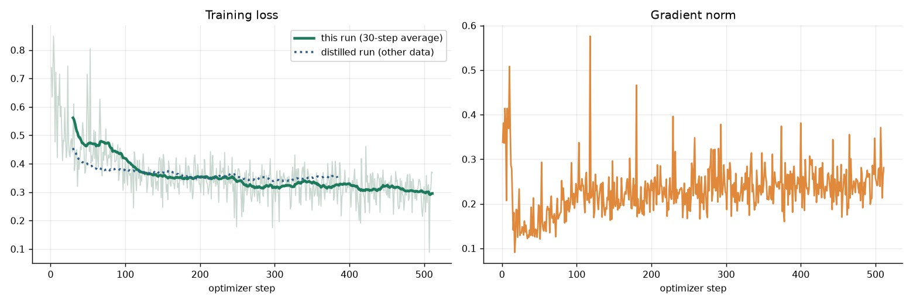
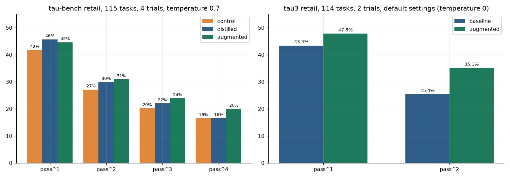
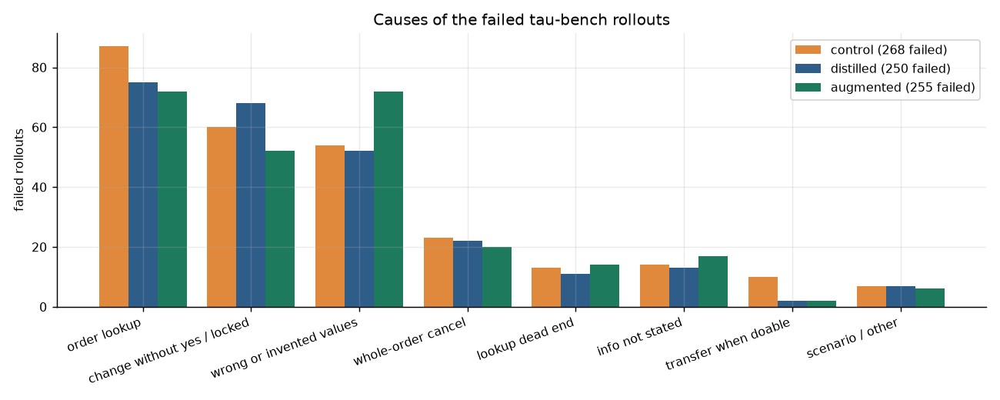

# Teaching a 14B agent to open every order and confirm every change (τ-bench / τ³ retail)

AI friendly

This branch contains **one experiment only**. The earlier experiments (SFT, GRPO, distillation from a Qwen3-32B teacher) are on `main` and on the `distillation-experiment` branch. Start with `notebooks/aug_sft_experiment.ipynb` (plotly, executed, outputs included).

## What we tried

The failure analysis of the distilled Qwen3-14B (59 failed τ³ tasks, 255 failed τ-bench rollouts) showed two big, fixable causes:

1. the agent **does not look at all of a customer's orders** before acting (about 28% of failures), and
2. it **changes the database before the customer clearly agrees** (about 20%), although the policy already says to confirm first.

We took the 180 teacher conversations of the distillation experiment (train tasks only) and rebuilt them **by rule from the retail database** so that:

- right after the account is loaded, the agent opens **every** order of the customer, one tool call per turn, with a short ledger-style reasoning;
- **every** change (cancel, return, exchange, modify) is preceded by an agent message that lists exactly what will happen (items, prices, refund or payment method, "the whole order will be cancelled", "exchange and item changes can be done once per order") and ends with a yes/no question, followed by a short customer "Yes".

178 conversations remained (two changed an order before authenticating the customer and were dropped): 710 lookups and 309 confirmations inserted, 4,086 per-turn samples. Training: a fresh LoRA on `unsloth/Qwen3-14B-unsloth-bnb-4bit`, same recipe as the distilled model (r=16, lr 5e-5, batch 8, 1 epoch = 511 steps, loss 0.65 → 0.30, 4.9 h on an A100).



## Results (nothing here is statistically significant)



**τ-bench retail test**, 115 tasks, 4 trials, temperature 0.7, GPT-4o customer (the same setup as the control and distilled runs):

| | starting adapter (control) | distilled | **augmented** |
|---|---|---|---|
| pass^1 | 41.7% ± 3.4 | 45.7% ± 3.4 | **44.6% ± 3.6** |
| pass^2 | 27.1% | 29.9% | 30.9% |
| pass^3 | 20.2% | 22.0% | 23.9% |
| pass^4 | 16.5% | 16.5% | 20.0% |

Paired by task, pass^1: augmented vs control **+2.8 points** (95% interval −2.6 to +8.7, permutation p = 0.37); vs distilled −1.1 points (p = 0.72).

**τ³ (tau2-bench) retail, default settings**: 114 tasks, 2 trials, agent temperature 0, up to 200 steps, GPT-4.1 customer:

| | baseline (starting adapter) | augmented |
|---|---|---|
| rollouts passed | 99 / 228 | 109 / 228 |
| pass^1 | 43.4% ± 3.7 | **47.8% ± 4.1** |
| pass^2 | 25.4% ± 4.1 | **35.1% ± 4.5** |
| rollouts hitting the 20-minute limit | 1 | 19 |

Paired by task: pass^1 **+4.4 points** (interval −3.5 to +12.3, p = 0.33); pass^2 **+9.6 points** (p = 0.063). Earlier τ³ runs used temperature 0.7 and 1 trial (starting adapter 46.5%, distilled 48.2%) and are not like-for-like.

## Did it learn the habits?

| | starting adapter | distilled | augmented |
|---|---|---|---|
| changes that came right after an explicit yes (τ-bench) | 44% | 37% | **59%** |
| tasks with 2+ orders where all orders were opened before the first change | 18% | 21% | **24%** |
| opened an order straight after loading the account | 66% | 59% | **37%** |

**Confirmation: yes. Lookup: no, it even got worse at the first step.** In training, 177 of the 178 conversations open an order right after the account is loaded, yet in evaluation the model does so in only 37% of rollouts. The "open every order" decision was only 178 examples (about 1% of the agent text) against about 3,900 unchanged ones, the unchanged turns often ask the customer for an order id, and the model's own reasoning habit ("which order does the user mean, I should ask") overrides the trained one.

## Failure causes

A rule-based classifier (successful database changes vs the task's target actions, plus a few conversation facts) assigns each failed τ-bench rollout to a cause; it was checked against about 20 hand-read dialogs and fixed three times. The failed τ³ tasks of the starting adapter and the distilled model were classified by reading every dialog.



| cause (failed rollouts) | control (268) | distilled (250) | augmented (255) |
|---|---|---|---|
| wrong or incomplete order lookup | 87 | 75 | 72 |
| changed the database without a yes or before the facts (incl. locked orders) | 60 | 68 | 52 |
| wrong or invented values | 54 | 52 | 72 |
| cancelled a whole order for a one-item request | 23 | 22 | 20 |
| account lookup dead end | 13 | 11 | 14 |
| required information not stated | 14 | 13 | 17 |
| transferred when the task was doable | 10 | 2 | 2 |
| other / scenario problem | 7 | 7 | 6 |

Changing before a yes fell (52 vs 68) and wrong values rose (72 vs 52). The augmented model also uses more steps: it hit the 25-step limit in 27 of 460 τ-bench rollouts (control 7, distilled 10).

## What is not done

We built, but have **not trained**, a habit-only dataset in which only the lookup and confirmation turns carry loss (898 conversations, 3,830 supervised turns: 178 real, 341 synthetic lookups and 379 synthetic confirmations built from customers no test task uses): `code/augmentation/build_habit_data.py`, trained with `code/augmentation/train_sft_habits.py` (it can start from an existing adapter). Other ideas that came out of this: evaluate under τ-bench's default settings (temperature 0, 30 steps), rejection-sampling fine-tuning on the model's own habit-compliant successes, and a verification step before every confirmation.

## Files

```
notebooks/aug_sft_experiment.ipynb   training, both evaluations, behaviour measures, τ³ default-settings run (plotly)
notebooks/tau3_retail_eval.ipynb     the first τ³ run (temperature 0.7, 1 trial)
code/augmentation/                   build_augmented_sft.py (inserts lookups and confirmations by rule), verify_augmented.py,
                                     build_habit_data.py, train_sft_habits.py, classify_failures.py, render_*.py,
                                     progress trackers (update_*_json.py), checkpoint sync, pod scripts (pod/)
code/tau3/                           τ³ helpers: JSON tracker, notebook builder, dialog renderer, pod scripts
results/augmentation/                aug_sft_run.json (training curves and evaluation status), tau3_std_run.json, tau3_run.json,
                                     failure_causes_auto.json, new_model_failure_causes.json, old_model_failure_causes.json
dataset/augmentation/                the augmented SFT dataset (178 conversations), the habit-only dataset, their statistics,
                                     all 460 conversations of the augmented 4-trial τ-bench test (+ per-rollout results)
dataset/tau3_eval/                   all τ³ conversations: default-settings run (baseline and augmented, 228 each) and the first run
figures/                             the three charts above
```

**Also on Hugging Face** (same datasets and conversations, plus the rendered dialog pages): [teacher57/tau-retail-distillation](https://huggingface.co/datasets/teacher57/tau-retail-distillation) (folders `augmentation/`, `retail_eval_conversations/`, `tau3_eval/`, `renders/`). The adapter: [teacher57/qwen3-14b-tau-lookup-confirm-augmented](https://huggingface.co/teacher57/qwen3-14b-tau-lookup-confirm-augmented), intermediate checkpoints in [teacher57/qwen3-14b-tau-grpo-checkpoints](https://huggingface.co/teacher57/qwen3-14b-tau-grpo-checkpoints) as `aug-step-*`.

The builders expect the project layout (`sft_aug/` next to `tau3/tau2-bench/`); the input conversations (`teacher32b_passed_sft_reasoning.json`) and the test tasks (`retail_test_tasks.json`) are in the same Hugging Face dataset under `teacher/`. API keys come from the environment and are never stored; pod addresses in the scripts are defaults for pods that no longer exist.
